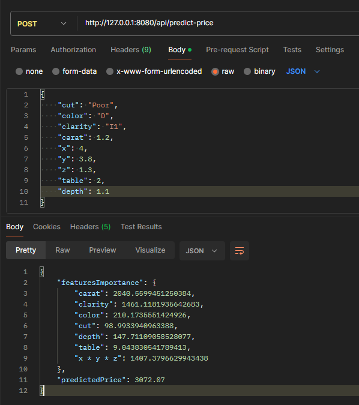
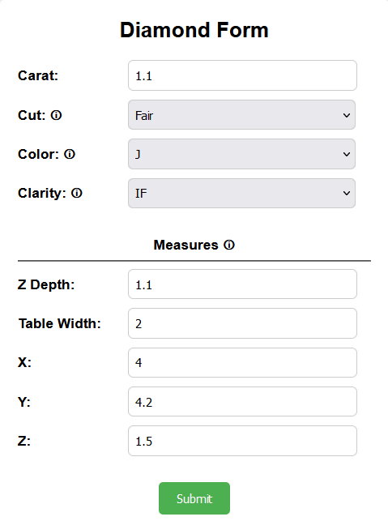
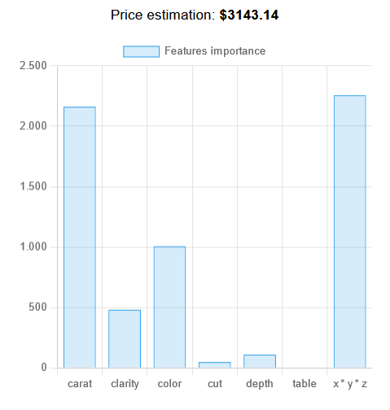

# Diamonds Price Predition
<div align="center">
  
  
  
</div>

This project aims to make a ML model able to predict the price of diamonds based on their characteristics, such as carat weight, cut, color, clarity and physical measurements. Made to learn Flask and practice with machine learning techniques.

The Jupyter Notebook is available [here](http://colab.research.google.com/drive/1H7VoevZx1NJzO6LREsGGekPzfUgccb2h "here"), which contains various steps, from Data Understanding to the effective Modeling.
Here a summerized overview:

- Data Exploration: analysis of the dataset and data understanding (data distributions, missing values, outliers, data correlations etc.)

- Data Preparation: transformation and normalization of features, encoding of categorical variables, handling of outliers.

- Modeling: prepare the training data and use of different machine learning algorithms to train predictive models.

- Evaluation: evaluation the model performance using various metrics, such as R2 score, mean absolute error (MAE), and root mean squared error (RMSE).

- Deployment: save the model to be used in a small webapp, using Flask, through form or API call


## How to run
1. Clone this repo
	`git clone https://github.com/DS-Ale/diamonds-price-estimation`
2. Move to the repo directory
`cd diamonds-price-estimation`
3. **(Optional)** Create a Python virtual env
	`python -m venv .venv`
	- Activate the env
		- **Linux**: `source .venv/bin/activate`
		- **Windows**: `.\.venv\Scripts\activate`
	
		**NB:** If using *Powershell*, you may have to change the scripts execution policies, by running (this will affect the current shell only)
	`Set-ExecutionPolicy Unrestricted -Scope Process`
4. Install the required dependencies
`pip install -r requirements.txt`
5. Run Flask
`flask run -p 8080 --debug`
6. Reach `http://127.0.0.1:8080` (or whichever host/port you used)
7. Fill the form and click **Submit** to get a prediction

### API
- To get a prediction through API, you can send a POST request to `http://HOST:PORT/api/predict-price`, including the required data as JSON body.
**Eg.**
```shell
curl --location 'http://127.0.0.1:8080/api/predict-price' \
--header 'Content-Type: application/json' \
--data '{
    "cut": "Poor",
    "color": "D",
    "clarity": "I1",
    "carat": 1.2,
    "x": 4,
    "y": 3.8,
    "z": 1.3,
    "table": 2,
    "depth": 1.1
}'
```
